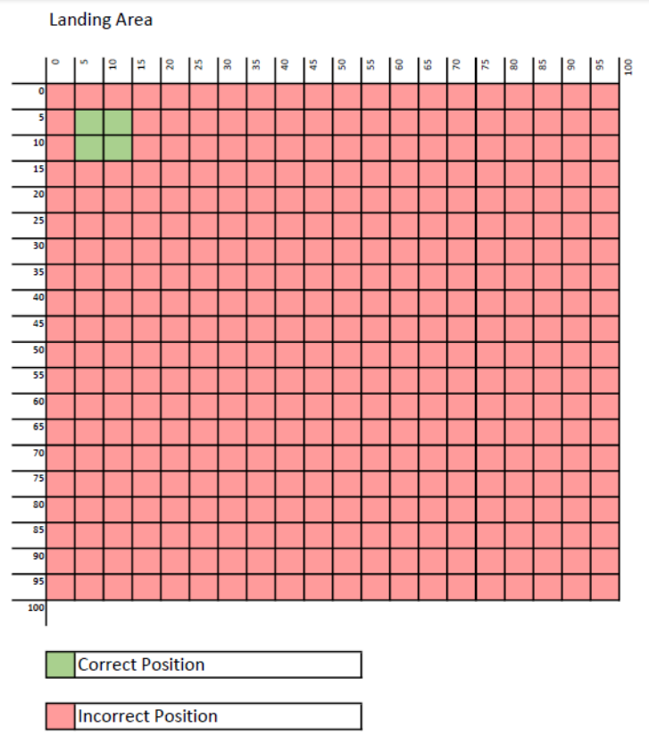
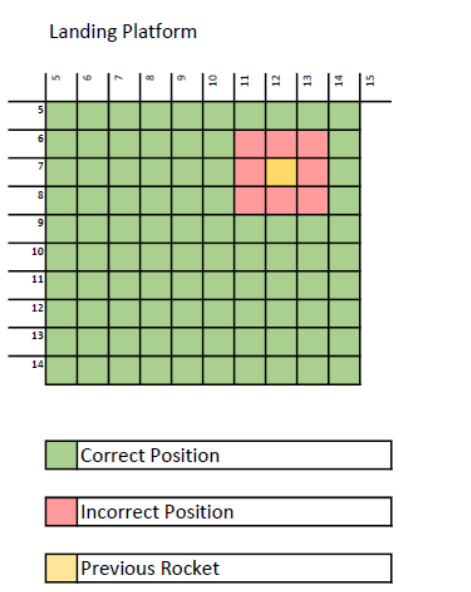

# Rocket Landing App

The solution is implemented in Microsoft Visual Studio 2019 using .Net Core 3.1 as a framework.
This solution is consisted of four libraries 
- Zartis.RocketLanding  - Library for the main business logic
- Zartis.RocketLanding.Abstractions
- Zartis.RocketLanding.Tests - Unit test implemented using xUnit.
- Zartis.RocketLanding.ConsoleTest - A console app for testing purposes 

## How to run

- Install Microsoft Visual Studio 2019 or above and install .Net Core 3.1 framework
- Open Zartis.RocketLanding.sln with the Visual Studio
- Build the solution to install and restore Nuget packages.
- Set project Zartis.RocketLanding.ConsoleTest as startup project and run it with Debug -> Start

## Library improvements

- Better configuration for setup the platform size.

# Exercise

You need to design a library that will help determine if rockets can land on a platform. 
Whenever rocket is getting back from the orbit, it needs to check every now and then if it's on 
a correct trajectory to safely land on a platform. Whole landing area (area that contains 
landing platform and surroundings) consists of multiple squares that set a 
perimeter/dimensions that can be described with coordinates (say x and y). Assuming that 
landing area has size of square 100x100 and landing platform has a size of a square 10x10 
and it's top left corner starts at a position 5,5 (please assume that position 0,0 is located at 
the top left corner of landing area and all positions are relative to it), library should work as 
follows:

- if rocket asks for position 5,5 it replies `ok for landing`
- if rocket asks for position 16,15, it replies `out of platform`
- if the rocket asks for a position that has previously been checked by another rocket (only last check counts), it replies with `clash`
- if the rocket asks for a position that is located next to a position that has previously been checked by another rocket (say, previous rocket asked for position 7,7 and the rocket asks for 7,8 or 6,7 or 6,6), it replies with `clash`.Given the above.

Please create a library (just library, it doesn't need to be used on any cli/gui) that will support 
following features:
- rocket can query it to see if it's on a good trajectory to land at any moment
- library can return one of the following values: 'out of platform', 'clash', 'ok for landing'
- more than one rocket can land on the same platform at the same time and rockets need to have at least one unit separation between their landing positions
- platform size can vary and should be configurable

